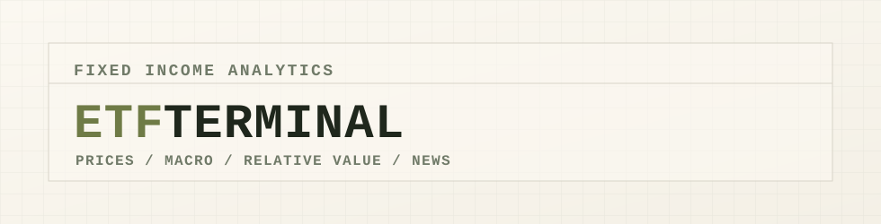

<p align="center">
  
</p>

<p align="center">
  Fixed income ETF analytics, macro context, relative value, and curated market news in one Streamlit terminal.
</p>

<p align="center">
  <a href="#quick-start">Quick Start</a> |
  <a href="#data-workflows">Data Workflows</a> |
  <a href="#database">Database</a> |
  <a href="#development">Development</a>
</p>

---

## Overview

ETF Terminal is a research dashboard for fixed income ETF monitoring. It combines ETF price history from Financial Modeling Prep, issuer/FMP ETF metadata, macro time series from FRED, precomputed analytics snapshots, and a market news layer backed by local SQLite or Supabase/Postgres.

The app is designed as an operating terminal: fast to refresh, easy to inspect, and explicit about where data comes from.

## Capabilities

- Monitor a curated fixed income ETF universe across rates, credit, aggregate bonds, mortgages, municipals, TIPS, floating rate, and EM debt.
- Refresh price history, metadata, macro series, macro features, and analytics snapshots from command-line workflows.
- Run against local SQLite for development or Supabase/Postgres for shared UAT-style usage.
- Analyze ETF performance, risk proxies, relative value, liquidity, macro context, and curated news in Streamlit.
- Keep database setup repeatable through schema helpers and migration scripts.

## Project Map

| Path | Purpose |
| --- | --- |
| `config/` | Application settings, ticker universe, environment loading, model rules |
| `db/` | Engine creation, schema definitions, SQL helpers, migration notes |
| `stores/` | Database read/write access for ETF, price, macro, news, and analytics data |
| `fixed_income/` | ETF domain objects, provider analytics, risk proxy selection, analytics services |
| `services/` | External data clients and higher-level data services |
| `dashboard/` | Streamlit UI, pages, tabs, components, charts, and global theme |
| `scripts/` | CLI entrypoints for setup, refresh, migration, ticker management, and maintenance |
| `tests/` | Focused tests grouped by usage area |

## Prerequisites

- Python 3.11+
- FMP API key
- FRED API key
- Optional: Supabase/Postgres connection string

Install runtime and development dependencies:

```bash
python -m venv .venv
source .venv/bin/activate
pip install -r requirements.txt
pip install -r requirements-dev.txt
```

## Environment

Create a `.env` file in the project root. Use `.env.example` as the starting point.

Local SQLite:

```env
FMP_API_KEY=your_fmp_key
FRED_API_KEY=your_fred_key
DATA_BACKEND=local
APP_ENV=uat
```

Supabase:

```env
FMP_API_KEY=your_fmp_key
FRED_API_KEY=your_fred_key
DATA_BACKEND=supabase
APP_ENV=uat
SUPABASE_SCHEMA=public
SUPABASE_DB_URL=postgresql+psycopg://postgres.<project_ref>:<password>@aws-1-us-east-2.pooler.supabase.com:5432/postgres?sslmode=require
```

Backend behavior:

| Setting | Behavior |
| --- | --- |
| `DATA_BACKEND=local` | Uses SQLite files such as `market_data_uat.db` |
| `DATA_BACKEND=supabase` | Uses Supabase/Postgres through `SUPABASE_DB_URL` |
| `APP_ENV=uat` | Uses the UAT environment and local UAT database file |
| `APP_ENV=prod` | Uses the production environment and local prod database file |

## Quick Start

Initialize a fresh local UAT database:

```bash
DATA_BACKEND=local APP_ENV=uat python -m scripts.db.initialize_database
DATA_BACKEND=local APP_ENV=uat python -m scripts.market.sync_securities_universe --mode upsert
DATA_BACKEND=local APP_ENV=uat python -m scripts.market.sync_price_history --mode full --period 3y
DATA_BACKEND=local APP_ENV=uat python -m scripts.market.sync_static_metadata --mode missing-only
DATA_BACKEND=local APP_ENV=uat python -m scripts.market.enrich_metadata_from_fmp --mode upsert
DATA_BACKEND=local APP_ENV=uat python -m scripts.macro.sync_macro_data --mode full --start 2000-01-01
DATA_BACKEND=local APP_ENV=uat python -m scripts.macro.build_macro_features
```

Run the app locally:

```bash
DATA_BACKEND=local APP_ENV=uat streamlit run main.py
```

Run the app against Supabase:

```bash
DATA_BACKEND=supabase APP_ENV=uat streamlit run main.py
```

## Data Workflows

Full daily refresh:

```bash
python -m scripts.daily.refresh_all --backend supabase --app-env uat
```

Force analytics snapshots to recompute:

```bash
python -m scripts.daily.refresh_all --backend supabase --app-env uat --force-analytics
```

Refresh the last four days of market data and recompute analytics:

```bash
python -m scripts.daily.refresh_all --backend supabase --app-env uat --price-overlap-days 4 --macro-overlap-days 4 --force-analytics
```

Refresh price history only:

```bash
python -m scripts.market.sync_price_history --mode incremental --overlap-days 2
```

Backfill price history:

```bash
python -m scripts.market.sync_price_history --mode full --period 3y
```

Refresh macro data and features:

```bash
python -m scripts.macro.sync_macro_data --mode incremental
python -m scripts.macro.build_macro_features
```

Refresh ETF metadata:

```bash
python -m scripts.market.sync_static_metadata --mode missing-only
python -m scripts.market.enrich_metadata_from_fmp --mode upsert
```

## ETF Universe

The configured universe lives in `config/config.json`.

Sync the configured universe into the database:

```bash
python -m scripts.market.sync_securities_universe --mode upsert
```

Replace the database universe with the configured universe:

```bash
python -m scripts.market.sync_securities_universe --mode full-replace
```

Add a ticker:

```bash
python -m scripts.admin.manage_universe_ticker add BSV
```

Add a ticker with an asset class override:

```bash
python -m scripts.admin.manage_universe_ticker add BSV --asset-class "Core Bond"
```

Delete a ticker everywhere:

```bash
python -m scripts.admin.manage_universe_ticker delete BSV
```

Ticker deletion removes rows from `etf_universe`, `etf_metadata`, and `price_history`.

## Database

Core tables:

| Table | Purpose |
| --- | --- |
| `etf_universe` | Active ETF ticker universe and high-level categorization |
| `etf_metadata` | ETF descriptions, issuer data, duration, YTM, OAS, maturity, convexity, and provider metadata |
| `price_history` | ETF end-of-day OHLCV history |
| `macro_data` | Raw FRED macro time series |
| `macro_features` | Derived macro indicators used by the Macro page |
| `analytics_snapshots` | Precomputed ETF analytics used by the dashboard |
| `news_items` | Normalized news feed records |

Create or migrate the current schema:

```bash
DATA_BACKEND=supabase APP_ENV=uat python - <<'PY'
from db.connection import get_engine
from db.schema import create_tables

engine = get_engine(data_backend="supabase", app_env="uat")
create_tables(engine)
print("Supabase UAT schema updated.")
PY
```

Migrate local UAT data into Supabase:

```bash
DATA_BACKEND=supabase APP_ENV=uat python -m scripts.db.initialize_database
DATA_BACKEND=supabase APP_ENV=uat python -m scripts.db.migrate_local_to_supabase --source-env uat
```

Check local row counts:

```bash
python - <<'PY'
import sqlite3

conn = sqlite3.connect("market_data_uat.db")
cur = conn.cursor()
for table in ["etf_universe", "etf_metadata", "price_history", "macro_data", "macro_features"]:
    cur.execute(f"select count(*) from {table}")
    print(table, cur.fetchone()[0])
conn.close()
PY
```

Check Supabase row counts:

```sql
select count(*) from public.etf_universe;
select count(*) from public.etf_metadata;
select count(*) from public.price_history;
select count(*) from public.macro_data;
select count(*) from public.macro_features;
```

## App Structure

Main pages:

- `Home`: market framing, universe snapshot, and app context
- `Dashboard`: single ETF analytics, charts, risk summary, and relative value
- `News`: fixed income news feed, source tracker, filters, movers, and theme tracker
- `Macro`: Treasury curve, macro features, regime summary, and cross-market context

Dashboard tabs:

- `Graphs`
- `Analytics`
- `RV Analysis`

## Development

Run the validation suite:

```bash
python -m ruff check .
python -m black --check .
python -m pytest
```

Recommended change flow:

1. Update schema first when storage changes.
2. Update stores before services.
3. Update services before dashboard components.
4. Keep provider-specific logic outside the UI.
5. Validate against the backend you actually use for the workflow.

## Branch Workflow

Current working pattern:

- `uat` for active development and testing
- `main` for the stable branch

Typical process:

```bash
git checkout uat
git add .
git commit -m "Describe the change"
git push origin uat
```

Then open a pull request from `uat` into `main`.

## Data Sources

| Source | Used For |
| --- | --- |
| Financial Modeling Prep | ETF prices and market metadata |
| ETF issuer pages/APIs | Fixed income analytics such as duration, YTM, OAS, maturity, convexity |
| FRED | Macro and Treasury time series |
| RSS feeds in `config/config.json` | News page |

## Notes

- The app is for research and workflow support, not order execution.
- FRED daily Treasury series can lag same-day market closes.
- FMP end-of-day bars can lag until the final daily bar is published.
- Supabase uses the `public` schema explicitly to avoid pooler/search-path ambiguity.
